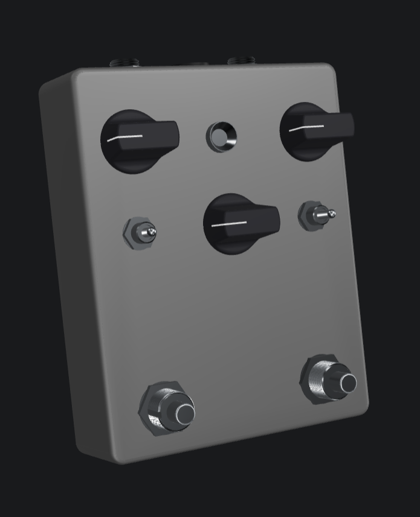
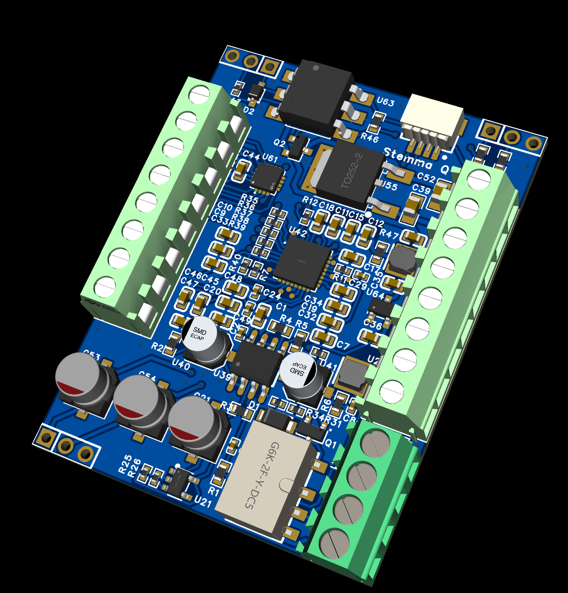
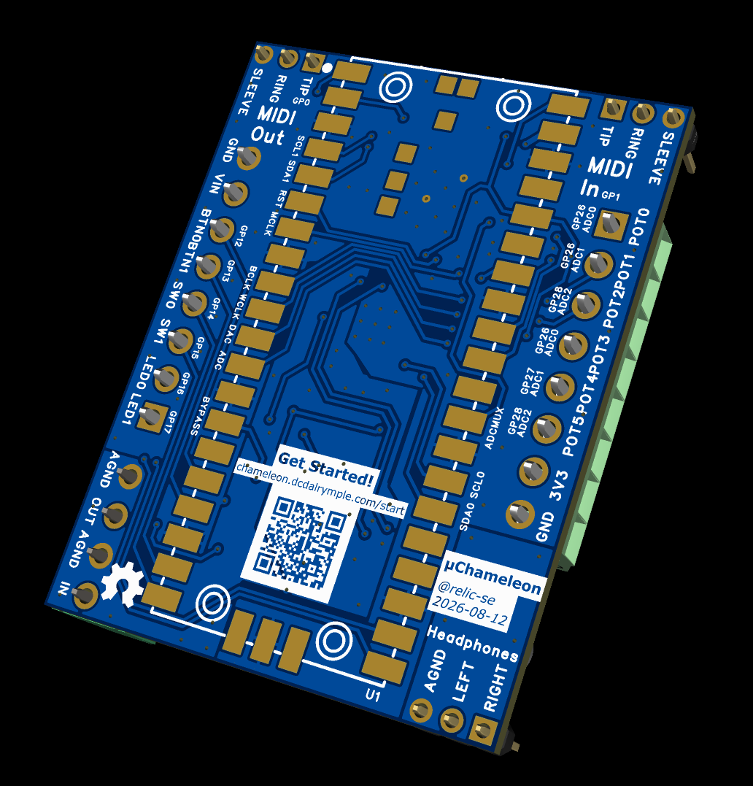

# μChameleon Hardware
Digital guitar effects pedal designed around the Raspberry Pi Pico 2 and the TLC320AIC3204.

| 3D Enclosure | PCB Top | PCB Bottom |
|-|-|-|
|  |  | 

## Software

- [CircuitPython Firmware](https://github.com/relic-se/uChameleon_CircuitPython)
- Arduino Firmware _(planned)_
